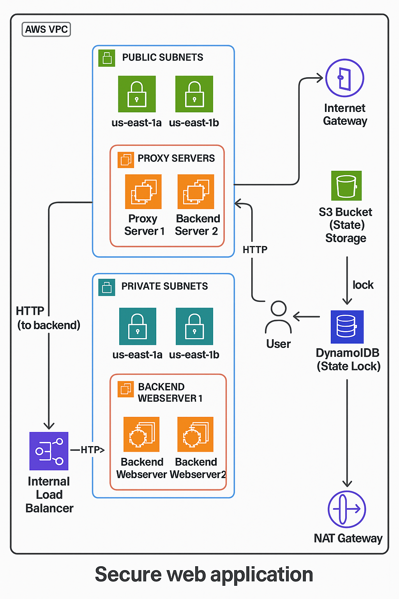

# Secure Web Application Deployment using Terraform on AWS

# Project Overview

This project provides an **automated infrastructure deployment** for a **Secure Flask Web Application** using **Terraform** on **AWS**.  
It includes provisioning the backend, proxy setup, network configurations, and automating deployment scripts.

---

# Architecture



### Components:

- **AWS Infrastructure** (Provisioned by Terraform):
  - VPC with Public & Private Subnets
  - EC2 Instances (Proxy & Backend Servers)
  - Security Groups & IAM Roles
  - Elastic IPs & NAT Gateway
  - S3 Backend for Terraform State Management

- **Flask Web Application**  
  A simple `cuteblog-flask` application deployed on EC2 with necessary configurations.

- **Proxy Layer**  
  Handles secure communication and forwards traffic to backend servers.

---

## ⚙️ Technologies & Tools

- **Terraform** - Infrastructure as Code
- **AWS** - Cloud Provider (EC2, VPC, S3, IAM, etc.)
- **Flask** - Python Web Framework
- **NGINX / Proxy** - Forward traffic securely
- **Bash Scripts** - Automate deployment steps

---

##  Project Structure


AWS-Proxy-Backend-Terraform-main/
│
├── flask_website/cuteblog-flask/ # Flask Application Code
├── modules/ # Terraform Modules (Reusable Infrastructure Code)
├── scripts/
│ ├── backendscript.sh # Backend Deployment Script
│ └── proxyscript.sh # Proxy Deployment Script
├── backend.tf # Terraform Backend Config
├── main.tf # Main Infrastructure Definitions
├── provider.tf # AWS Provider Configuration
├── variables.tf # Variables Definition (optional if added)
├── outputs.tf # Outputs from Terraform (optional if added)
├── .gitignore # Ignore unnecessary files
└── arch.PNG # Architecture Diagram

yaml
Copy
Edit

---

##  Deployment Steps

###  Initialize Terraform

```bash
terraform init
 Plan the Infrastructure
bash
Copy
Edit
terraform plan
 Apply the Infrastructure
bash
Copy
Edit
terraform apply
 Security Considerations
Separate Public Proxy Layer and Private Backend Layer.

Use of Security Groups & IAM Roles for access control.

Sensitive data is not stored in the codebase.

 Author
Karim Alaa
GitHub: karim555-55

